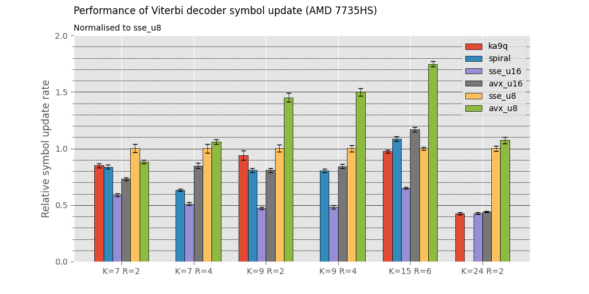
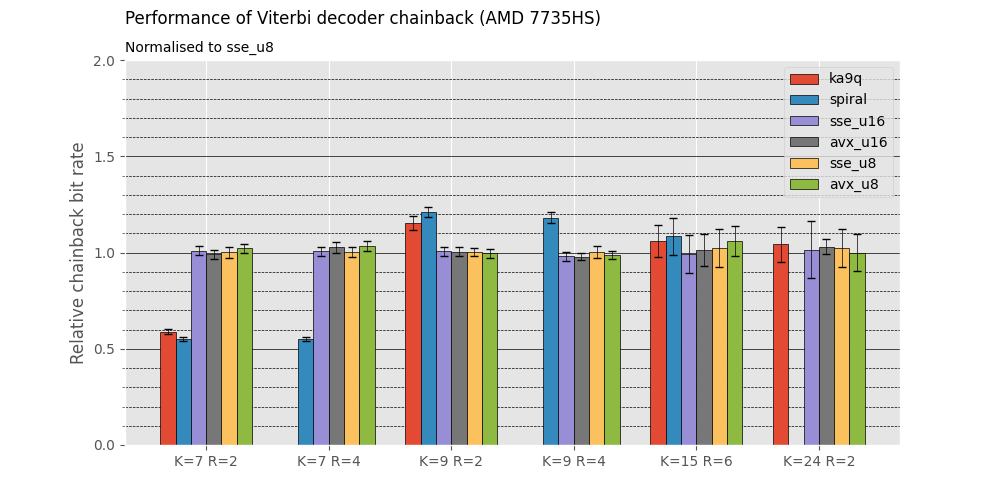

# Introduction
[](https://github.com/williamyang98/ka9q_viterbi_comparison/actions/workflows/x86-windows.yml)
[](https://github.com/williamyang98/ka9q_viterbi_comparison/actions/workflows/x86-linux.yml)

Benchmark comparisons between Viterbi decoders
- [ka9q](https://github.com/ka9q/libfec)
- [spiral](https://www.spiral.net/software/viterbi.html)
- [williamyang98](https://github.com/williamyang98/ViterbiDecoderCpp)

# Results



# Build instructions
1. Configure cmake: ```cmake . -B build --preset windows-msvc -DCMAKE_BUILD_TYPE=Release```.
2. Compile program: ```cmake --build build```.
3. Run program: ```./build/main.exe```.

# Plot instructions
1. Setup python virtual environment: ```python -m venv venv```.
2. Activate python virtual environment: ```source ./venv/*/activate```.
3. Install dependencies: ```pip install -r ./scripts/requirements.txt```.
4. Run scripts.
    - Tabulate results: ```./scripts/tabulate_data.py```.
    - Plot results: ```./scripts/plot_data.py```.
